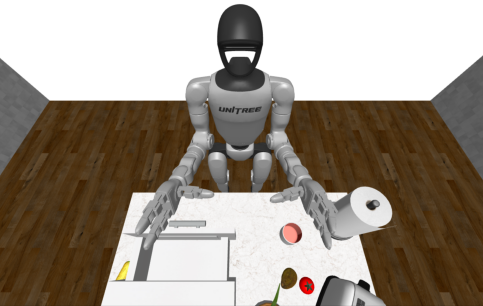
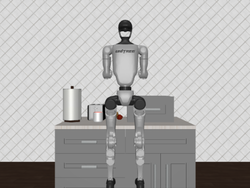
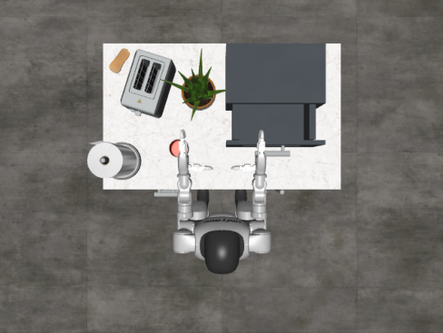

# Robocasa-G1

<p align="center">
  
  
  
</p>

**Robocasa-G1** is built upon the [Robocasa](https://github.com/robocasa/robocasa) and [RoboCasa GR-1 Tabletop Tasks](https://github.com/robocasa/robocasa-gr1-tabletop-tasks) simulation frameworks.
This repository is a fork that adds support for the **Unitree G1 humanoid robot**.
It integrates the G1 model, assets, and control interface into Robocasa’s household manipulation environments, enabling tabletop tasks specifically tailored to G1’s kinematics and workspace.

---

## Overview

Robocasa-G1 enables:
- Simulation of Unitree G1 in Robocasa environments
- Tabletop task setups adapted for G1 reach and joint limits
- Ready-to-use environment configurations for RL and imitation learning

---

## Key Changes from Original Robocasa
- Added **G1 URDF** and mesh assets
- Updated robot model loader to support G1 joint naming & limits
- Tuned tabletop task scene layouts to match G1’s manipulation range

---

## Getting Started
The easiest way to set up is through the [Anaconda](https://www.anaconda.com/) package management system. Follow the instructions below to install all three required repositories, their dependencies, and download the assets needed for the simulation task:

```bash
# 1. Set up conda environment
conda create -c conda-forge -n robocasa python=3.10
conda activate robocasa

# 2. Clone and install Isaac-GR00T
git clone https://github.com/hogunkee/GR00T_G1 
pip install --upgrade setuptools
pip install -e GR00T_G1
pip install --no-build-isolation flash-attn==2.7.1.post4 

# 3. Clone and install robosuite
git clone https://github.com/hogunkee/robosuite_g1 
pip install -e robosuite_g1

# 4. Clone and install robocasa-g1-tabletop-tasks
git clone https://github.com/hogunkee/robocasa_g1 
pip install -e robocasa_g1

# 5. Download assets
cd robocasa_g1
python robocasa/scripts/download_tabletop_assets.py -y
```

## Simulation-based Evaluation for GR00T-N1.5-3B

The main purpose of this repository is to evaluate the model in simulation to better understand its behavior in closed-loop settings. This is especially useful for assessing quantitative performance on long-horizon or multi-step tasks.

Please refer to https://github.com/hogunkee/GR00T_G1 to install Isaac-GR00T **for Unitree G1**.

Inside the GR00T_G1 repository, run the inference server:

```bash
cd Isaac-GR00T
python3 scripts/inference_service.py --server \
    --model_path <MODEL_PATH> \
    --data_config gr1_arms_waist
```

Inside the Isaac-GR00T repository, run the simulation evaluation script to evaluate a single task with 10 episodes.

```bash
cd Isaac-GR00T
python3 scripts/simulation_service.py --client \
    --env_name <TASK_NAME> \
    --video_dir ./videos \
    --max_episode_steps 720 \
    --n_envs 5 \
    --n_episodes 10
```

This script will run the model in a simulated environment for a given number of episodes, collect success metrics, and save rollout videos for inspection. It's a complementary method to the offline evaluation that gives insight into how the policy performs when interacting with the environment. Here is a full list of 24 tabletop task names:

```bash
gr1_unified/PnPCupToDrawerClose_GR1ArmsAndWaistFourierHands_Env
gr1_unified/PnPPotatoToMicrowaveClose_GR1ArmsAndWaistFourierHands_Env
gr1_unified/PnPMilkToMicrowaveClose_GR1ArmsAndWaistFourierHands_Env
gr1_unified/PnPBottleToCabinetClose_GR1ArmsAndWaistFourierHands_Env
gr1_unified/PnPWineToCabinetClose_GR1ArmsAndWaistFourierHands_Env
gr1_unified/PnPCanToDrawerClose_GR1ArmsAndWaistFourierHands_Env
gr1_unified/PosttrainPnPNovelFromCuttingboardToBasketSplitA_GR1ArmsAndWaistFourierHands_Env
gr1_unified/PosttrainPnPNovelFromCuttingboardToCardboardboxSplitA_GR1ArmsAndWaistFourierHands_Env
gr1_unified/PosttrainPnPNovelFromCuttingboardToPanSplitA_GR1ArmsAndWaistFourierHands_Env
gr1_unified/PosttrainPnPNovelFromCuttingboardToPotSplitA_GR1ArmsAndWaistFourierHands_Env
gr1_unified/PosttrainPnPNovelFromCuttingboardToTieredbasketSplitA_GR1ArmsAndWaistFourierHands_Env
gr1_unified/PosttrainPnPNovelFromPlacematToBasketSplitA_GR1ArmsAndWaistFourierHands_Env
gr1_unified/PosttrainPnPNovelFromPlacematToBowlSplitA_GR1ArmsAndWaistFourierHands_Env
gr1_unified/PosttrainPnPNovelFromPlacematToPlateSplitA_GR1ArmsAndWaistFourierHands_Env
gr1_unified/PosttrainPnPNovelFromPlacematToTieredshelfSplitA_GR1ArmsAndWaistFourierHands_Env
gr1_unified/PosttrainPnPNovelFromPlateToBowlSplitA_GR1ArmsAndWaistFourierHands_Env
gr1_unified/PosttrainPnPNovelFromPlateToCardboardboxSplitA_GR1ArmsAndWaistFourierHands_Env
gr1_unified/PosttrainPnPNovelFromPlateToPanSplitA_GR1ArmsAndWaistFourierHands_Env
gr1_unified/PosttrainPnPNovelFromPlateToPlateSplitA_GR1ArmsAndWaistFourierHands_Env
gr1_unified/PosttrainPnPNovelFromTrayToCardboardboxSplitA_GR1ArmsAndWaistFourierHands_Env
gr1_unified/PosttrainPnPNovelFromTrayToPlateSplitA_GR1ArmsAndWaistFourierHands_Env
gr1_unified/PosttrainPnPNovelFromTrayToPotSplitA_GR1ArmsAndWaistFourierHands_Env
gr1_unified/PosttrainPnPNovelFromTrayToTieredbasketSplitA_GR1ArmsAndWaistFourierHands_Env
gr1_unified/PosttrainPnPNovelFromTrayToTieredshelfSplitA_GR1ArmsAndWaistFourierHands_Env
```
